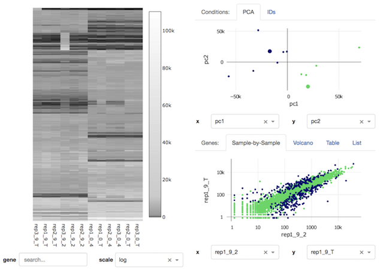

### ☞ *Are you using this? Or do you want to?*  ☜ 

We'd be really interested in getting feedback from users or potential users. Are you able to get it started? Does it support the file formats and visualizations you use most often? Please file an issue or reach out on email. Thanks! 

# heatmap-scatter-dash

A heatmap-scatterplot using [Dash by plotly](https://plot.ly/products/dash/).
From the commandline it can be started on localhost or AWS, or it can be run
from the [Refinery](https://github.com/refinery-platform/refinery-platform) GUI.



```
$ python app_runner.py -h
usage: app_runner.py [-h] (--demo ROWS COLS META | --files CSV [CSV ...])
                     [--diffs CSV [CSV ...]] [--meta CSV]
                     [--most_variable_rows ROWS] [--port PORT] [--profile]
                     [--html_error] [--debug] [--api_prefix PREFIX]

Light-weight visualization for differential expression

optional arguments:
  -h, --help            show this help message and exit
  --demo ROWS COLS META
                        Generates a random matrix with the number of rows and
                        columns specified. In addition, "META" determines the
                        number of mock metadata fields to associate with each
                        column.
  --files CSV [CSV ...]
                        Read CSV or TSV files. Identifiers should be in the
                        first column and multiple files will be joined on
                        identifier. Compressed files are also handled, if
                        correct extension is given. (ie ".csv.gz")
  --diffs CSV [CSV ...]
                        Read CSV or TSV files containing differential
                        expression data.
  --meta CSV            Read CSV or TSV files containing metadata: Row labels
                        should match column headers of the raw data.
  --most_variable_rows ROWS
                        For the heatmap, we first sort by row variance, and
                        then take the number of rows specified here. Defaults
                        to 500.
  --port PORT           Specify a port to run the server on. Defaults to 8050.

Refinery/Developer:
  These parameters will probably only be of interest to developers, and/or
  they are used when the tool is embedded in Refinery.

  --profile             Log profiling data on startup and with each callback.
  --html_error          If there is a configuration error, instead of exiting,
                        start the server and display an error page.
  --debug               Run the server in debug mode: The server will restart
                        in response to any code changes, and some hidden
                        fields will be shown.
  --api_prefix PREFIX   Prefix for API URLs.
```

## Getting Started

Check out the project and install dependencies:
```bash
  # Requires Python3:
$ python --version
$ git clone https://github.com/refinery-project/heatmap-scatter-dash.git
$ cd heatmap-scatter-dash
$ pip install -r context/requirements-freeze.txt
```

To run it locally:

```bash
$ cd context

  # Generate a random matrix:
$ ./app_runner.py --demo 100 10 5

  # Load data from disk:
$ ./app_runner.py --files ../fixtures/good/data/counts.csv \
                  --diffs ../fixtures/good/data/stats-* \
                  --meta ../fixtures/good/data/metadata.csv
```

and visit `http://localhost:8050/`.

To run it on AWS:

```bash
$ cd context
$ mkdir data

  # AWS needs to know where to create your resources.
  # This will fail if your AWS credentials are not in place.
$ eb init

$ ./app_runner_aws.py --name demo --files ../fixtures/good/data/counts.csv --diffs ../fixtures/good/data/stats-*
```

After a few minutes, the server will start and the URL to visit will be displayed.

## Testing

One bash script, `test.sh`, handles all our tests:
- Python unit tests
- Python style tests (`flake8` and `isort`)
- Cypress.io interaction tests
- Docker container build and launch

A few more dependencies are required for this to work locally:
```bash
  # Install Docker: https://www.docker.com/community-edition
$ pip install -r requirements-dev.txt
$ npm install cypress --save-dev
```

## Release

Successful Github tags and PRs will prompt Travis to push the built image to Dockerhub. For a new version number:

```bash
$ git tag v0.0.x && git push origin --tags
```

## For More Information...

There are a few [notes](docs) on implementation decisions and lessons learned.

The [online help](context/app/help/help.md) can be previewed to get a better sense of the operational details.
